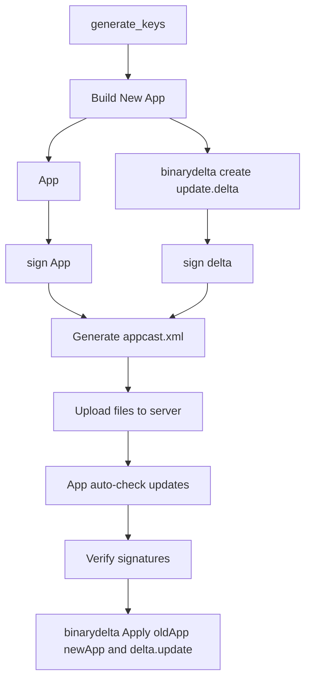

# SparkleUpdateTool for Publisher / Updater

# Fork and Clone  
https://github.com/sparkle-project/Sparkle.git

# Build Release  Version4.1

- Copy `binarydelta` from the `Release` folder to `/usr/local/bin/binarydelta`  
- Copy `sign_update` from the `Release` folder to `/usr/local/bin/sign_update`  
- Copy `generate_keys` from:  
  `/Users/lijiaxi/Library/Developer/Xcode/DerivedData/Sparkle-fromtshtpkdymdbrcldzhggburwb/SourcePackages/artifacts/sparkle/Sparkle/bin/generate_keys`  
  to `/usr/local/bin/generate_keys`  
  
- Meanwhile w/ Website ready ,user can download those from offical website.  

## Step 0 : Generate Public and Private Keys Using `generate_keys`

### Not a Must
- If you're on macOS, the private key will be saved into your Keychain, and the public key will be printed to the console.
- Add the public key to the `Info.plist` of each app you want to update.
- If you're implementing the update system yourself, make sure to extract and verify the public key manually for signature validation.

## Step 1
签名成功了，对于SteamMetal.4.01.01.app 做了以下改动，

### 1. 删除了c_driver 
### 2. mv /Users/lijiaxi/Documents/sparkleOldApp/SteamMetal.4.01.01.app/Contents/Frameworks/renderer/d3dmetal \
   /Users/lijiaxi/Documents/sparkleOldApp/SteamMetal.4.01.01.app/Contents/Resources/

## Step 2:   binarydelta create update.delta

### Must Have
binarydelta create --verbose ./OStation.app ./OStationNew.app ./update.delta

Creating version 4.1 patch using default compression...
Processing source, ./OStation.app...
Processing destination, ./OStationNew.app...
Generating delta...
Writing to temporary file /Users/lijiaxi/Documents/sparkleOldApp/.update.delta.tmp...
✏️  Updated /Contents/Resources/Base.lproj/Main.storyboardc/Info.plist
✏️  Updated /Contents/Resources/Base.lproj/Main.storyboardc/NSWindowController-B8D-0N-5wS.nib
✅  Added /Contents/Resources/buy.html
✏️  Updated /Contents/Resources/download.html
🔨  Diffed /Contents/_CodeSignature/CodeResources
🔨  Diffed /Contents/MacOS/OStation
🔨  Diffed /Contents/Resources/Base.lproj/Main.storyboardc/MainMenu.nib
Done!

## Step 3 upload json file and delta file to website 
### Must Have

## Step 4:  Way of Updater
### SDK for origin app NOT USED NOW
- The app must periodically check the remote `appcast.xml`.  

### Not origin app USED NOW
- check json file from website to determind whether update or not 

## Step 5:  binarydelta apply 
binarydelta apply OStation.app NewStation.app update.delta --verbose
Applying version 4.1 patch...
Verifying source...
Copying files...
Patching...
✏️  Updated /Contents/Resources/Base.lproj/Main.storyboardc/Info.plist
✏️  Updated /Contents/Resources/Base.lproj/Main.storyboardc/NSWindowController-B8D-0N-5wS.nib
✅  Added /Contents/Resources/buy.html
✏️  Updated /Contents/Resources/download.html
🔨  Patched /Contents/_CodeSignature/CodeResources
🔨  Patched /Contents/MacOS/OStation
🔨  Patched /Contents/Resources/Base.lproj/Main.storyboardc/MainMenu.nib
Verifying destination...
Done!

---

## Additional Notes:    
### To be tested: All target platforms and OStation compatibility.

---

## Flowchart

## 待测试 所有的游戏平台 和ostation

