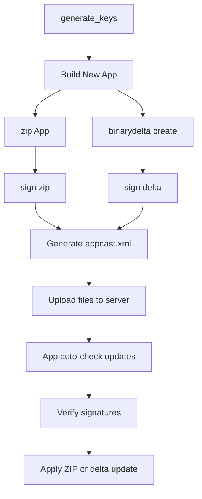

# SparkleUpdateTool for Publisher

## Fork and Clone  
https://github.com/sparkle-project/Sparkle.git

## Build Release  
- Copy `binarydelta` from the `Release` folder to `/usr/local/bin/binarydelta`  
- Copy `sign_update` from the `Release` folder to `/usr/local/bin/sign_update`  
- Copy `generate_keys` from:  
  `/Users/lijiaxi/Library/Developer/Xcode/DerivedData/Sparkle-fromtshtpkdymdbrcldzhggburwb/SourcePackages/artifacts/sparkle/Sparkle/bin/generate_keys`  
  to `/usr/local/bin/generate_keys`  

---

## Step 1: Generate Public and Private Keys Using `generate_keys`

- If you're on macOS, the private key will be saved into your Keychain, and the public key will be printed to the console.
- Add the public key to the `Info.plist` of each app you want to update.
- If you're implementing the update system yourself, make sure to extract and verify the public key manually for signature validation.

```bash
generate_keys
```

Sample output:
```
A pre-existing signing key was found. This is how it should appear in your Info.plist:

<key>SUPublicEDKey</key>
<string>01v+wUd6hYpA0Riixc9C76nJm8vjn85uRJJiHNEIwKU=</string>
```

---

## Step 2:  
- Use `binarydelta` to generate a delta patch.  
- Zip the new app and use `sign_update` to sign both the delta and the `.zip`.  
- Generate `appcast.xml` and upload it to your update server.  
- The server must host the new app `.zip`, the `.delta` patch, and their respective signatures.

Sample `appcast.xml` structure:

```xml
<?xml version="1.0" encoding="utf-8"?>
<rss version="2.0" xmlns:sparkle="http://www.andymatuschak.org/xml-namespaces/sparkle"
     xmlns:dc="http://purl.org/dc/elements/1.1/">
  <channel>
    <title>App Updates</title>
    <link>https://yourserver.com/updates/</link>
    <description>Latest updates for your app</description>
    <language>en</language>

    <item>
      <title>Version 2.0</title>
      <sparkle:releaseNotesLink>https://yourserver.com/updates/release_notes_2.0.html</sparkle:releaseNotesLink>
      <pubDate>Fri, 18 Jul 2025 10:35:51 -0500</pubDate>
      <enclosure url="https://yourserver.com/updates/YourApp-2.0.zip"
                 sparkle:version="2.0"
                 sparkle:shortVersionString="2.0"
                 length="0"
                 type="application/octet-stream"
                 sparkle:edSignature="ApZHFghsd4Sl8nUy3eN2+XzO0VoD..." />

      <sparkle:delta>
        <enclosure url="https://yourserver.com/updates/YourApp-1.5-to-2.0.delta"
                   sparkle:version="2.0"
                   sparkle:deltaFrom="1.5"
                   length="34518"
                   type="application/octet-stream"
                   sparkle:edSignature="LWHx4F65ifViHpkguF0UziBnwYpi..." />
      </sparkle:delta>
    </item>
  </channel>
</rss>
```

---

## Step 3:  
- The app must periodically check the remote `appcast.xml`.  
- If a newer version is found, it will download the `.zip` or `.delta` based on the current version.  
- You can use `binarydelta apply` with an old `.zip` and a `.delta` to generate the updated `.app`.

```bash
binarydelta apply OldApp.zip update.delta NewApp.app
```

---

## Additional Notes:  
- Consider building a version management app to maintain all historical versions of your applications.  
- To be tested: All target platforms and OStation compatibility.

---

## Flowchart




# SparkleUpdateTool for Publisher

## fork and clone 
https://github.com/sparkle-project/Sparkle.git

## Build Release
## 把 Release 下的 binarydelta cp 到 /usr/local/bin/binarydelta
## 把 Release 下的 sign_update cp 到 /usr/local/bin/sign_update
## 把 Release 下的  /Users/lijiaxi/Library/Developer/Xcode/DerivedData/Sparkle-fromtshtpkdymdbrcldzhggburwb/SourcePackages/artifacts/sparkle/Sparkle/bin/generate_keys 

## cp 到 /usr/local/bin/generate_keys


## 第一步 用 generate_keys 产生公钥 和 私钥 
###    如果是在Mac 上则会把私钥保存进你的钥匙串，并输出公钥
###    把公钥放入每个要更新的app的 info.list里
###    如果自己写update 那要自己读出公钥 实现签名的认证

### SparkleUpdateTool % generate_keys
### A pre-existing signing key was found. This is how it should appear in your Info.plist:

### <key>SUPublicEDKey</key>
### <string>01v+wUd6hYpA0Riixc9C76nJm8vjn85uRJJiHNEIwKU=</string>


## 第二步 
### 用binarydelta 产生 增量delta
### zip new app 后 用sign_update 对delta 和 newApp.zip 签名
### 产生castxml 后放到服务器上 要包含newApp的zip ，delta 以及newApp的zip ，delta的签名，类似如下结构

    <?xml version="1.0" encoding="utf-8"?>
    <rss version="2.0" xmlns:sparkle="http://www.andymatuschak.org/xml-namespaces/sparkle"
         xmlns:dc="http://purl.org/dc/elements/1.1/">
      <channel>
        <title>App Updates</title>
        <link>https://yourserver.com/updates/</link>
        <description>Latest updates for your app</description>
        <language>en</language>

        <item>
          <title>Version 2.0</title>
          <sparkle:releaseNotesLink>https://yourserver.com/updates/release_notes_2.0.html</sparkle:releaseNotesLink>
          <pubDate>Fri, 18 Jul 2025 10:35:51 -0500</pubDate>
          <enclosure url="https://yourserver.com/updates/YourApp-2.0.zip"
                     sparkle:version="2.0"
                     sparkle:shortVersionString="2.0"
                     length="0"
                     type="application/octet-stream"
                     sparkle:edSignature="ApZHFghsd4Sl8nUy3eN2+XzO0VoD..." />

          <sparkle:delta>
            <enclosure url="https://yourserver.com/updates/YourApp-1.5-to-2.0.delta"
                       sparkle:version="2.0"
                       sparkle:deltaFrom="1.5"
                       length="34518"
                       type="application/octet-stream"
                       sparkle:edSignature="LWHx4F65ifViHpkguF0UziBnwYpi..." />
          </sparkle:delta>
        </item>
      </channel>
    </rss>

## 第三步 在本地需要定时检查网上的XML 文件 根据版本号进行更新
## 可以用 binarydelta apply old.zip 加 delta 产生新的 delta产生新app
## 新建一个app 用于版本控制和所有app的历史记录，所有app 历史记录
## 待测试 所有的游戏平台 和ostation

