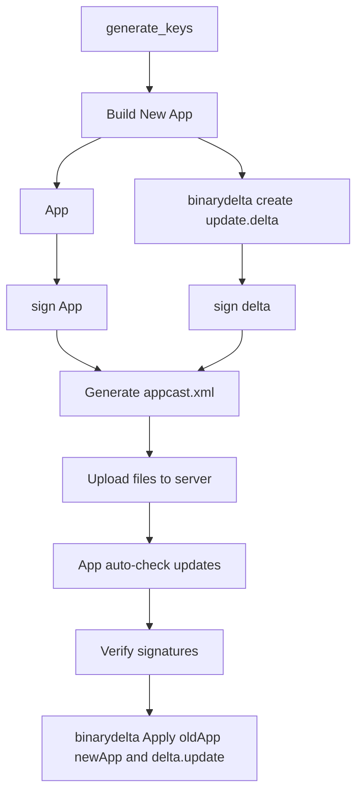

# SparkleUpdateTool for Publisher / Updater

# Fork and Clone  
https://github.com/sparkle-project/Sparkle.git

# Build Release  Version4.1

- Copy `binarydelta` from the `Release` folder to `/usr/local/bin/binarydelta`  
- Copy `sign_update` from the `Release` folder to `/usr/local/bin/sign_update`  
- Copy `generate_keys` from:  
  `/Users/lijiaxi/Library/Developer/Xcode/DerivedData/Sparkle-fromtshtpkdymdbrcldzhggburwb/SourcePackages/artifacts/sparkle/Sparkle/bin/generate_keys`  
  to `/usr/local/bin/generate_keys`  


## Step 1: Generate Public and Private Keys Using `generate_keys`

### Not a Must
- If you're on macOS, the private key will be saved into your Keychain, and the public key will be printed to the console.
- Add the public key to the `Info.plist` of each app you want to update.
- If you're implementing the update system yourself, make sure to extract and verify the public key manually for signature validation.

Sample output:
```
A pre-existing signing key was found. This is how it should appear in your Info.plist:

<key>SUPublicEDKey</key>
<string>01v+wUd6hYpA0Riixc9C76nJm8vjn85uRJJiHNEIwKU=</string>
```


## Step 2:   binarydelta create update.delta

### Must Have
binarydelta create --verbose ./OStation.app ./OStationNew.app ./update.delta

Creating version 4.1 patch using default compression...
Processing source, ./OStation.app...
Processing destination, ./OStationNew.app...
Generating delta...
Writing to temporary file /Users/lijiaxi/Documents/sparkleOldApp/.update.delta.tmp...
✏️  Updated /Contents/Resources/Base.lproj/Main.storyboardc/Info.plist
✏️  Updated /Contents/Resources/Base.lproj/Main.storyboardc/NSWindowController-B8D-0N-5wS.nib
✅  Added /Contents/Resources/buy.html
✏️  Updated /Contents/Resources/download.html
🔨  Diffed /Contents/_CodeSignature/CodeResources
🔨  Diffed /Contents/MacOS/OStation
🔨  Diffed /Contents/Resources/Base.lproj/Main.storyboardc/MainMenu.nib
Done!

## Step 3 Write into a appcast.xml and Upload it to website for updater
Sample `appcast.xml` structure:
### Not a Must

```xml
<?xml version="1.0" encoding="utf-8"?>
<rss version="2.0" xmlns:sparkle="http://www.andymatuschak.org/xml-namespaces/sparkle" xmlns:dc="http://purl.org/dc/elements/1.1/">
  <channel>
    <title>OStation_V15.app Updates</title>
    <link>https://unigo.com/updates/OStation_V15.app/appcast.xml</link>
    <description>Latest updates for OStation_V15.app</description>
    <language>en</language>
    <item>
      <title>Version 1.5</title>
      <sparkle:releaseNotesLink>https://unigo.com/updates/OStation_V15.app/release_notes_1.5.html</sparkle:releaseNotesLink>
      <pubDate>Tue, 22 Jul 2025 18:28:56 -0500</pubDate>
      <enclosure url="https://unigo.com/updates/OStation_V15.app/OStation_V15.app" sparkle:version="1.5" sparkle:shortVersionString="1.5" length="447640" type="application/octet-stream" sparkle:edSignature="full_sig" />
      <sparkle:delta>
        <enclosure url="https://unigo.com/updates/OStation_V15.app/upadte.delta" sparkle:version="1.5" sparkle:deltaFrom="1.5" length="6250" type="application/octet-stream" sparkle:edSignature="delta_sig" />
      </sparkle:delta>
    </item>
  </channel>
</rss>

```

## Step 4:  Way of Updater
### SDK for origin app
- The app must periodically check the remote `appcast.xml`.  
### Not origin app
- check manually inside Updater App 


## Step 5:  binarydelta apply 
binarydelta apply OStation.app NewStation.app update.delta --verbose
Applying version 4.1 patch...
Verifying source...
Copying files...
Patching...
✏️  Updated /Contents/Resources/Base.lproj/Main.storyboardc/Info.plist
✏️  Updated /Contents/Resources/Base.lproj/Main.storyboardc/NSWindowController-B8D-0N-5wS.nib
✅  Added /Contents/Resources/buy.html
✏️  Updated /Contents/Resources/download.html
🔨  Patched /Contents/_CodeSignature/CodeResources
🔨  Patched /Contents/MacOS/OStation
🔨  Patched /Contents/Resources/Base.lproj/Main.storyboardc/MainMenu.nib
Verifying destination...
Done!

---

## Additional Notes:  
### Consider building a version management app to maintain all historical versions of your applications.  
### To be tested: All target platforms and OStation compatibility.

---

## Flowchart


## 新建一个app 用于版本控制和所有app的历史记录，所有app 历史记录
## 待测试 所有的游戏平台 和ostation

| 参数名              | 示例值                                | 说明                     |
|---------------------|----------------------------------------|--------------------------|
| `appName`           | `"MyApp"`                              | 应用名称                 |
| `version`           | `"1.2.0"`                              | 完整版本号               |
| `shortVersion`      | `"1.2"`                                | 展示用短版本号           |
| `pubDate`           | `NSDate`                               | 发布日期（NSDate 对象）  |
| `dateString`        | `"Mon, 21 Jul 2025 10:00:00 +0000"`    | RFC 822 格式时间字符串   |
| `fullOldAppPath`    | `/path/to/MyApp-1.2.0.zip`             | 完整 App 包 zip 文件路径 |
| `deltaFilePath`     | `/path/to/1.1.0-to-1.2.0.delta`        | 增量更新包 `.delta` 路径 |
| `fullSignature`     | `"abcdef..."`                          | zip 包签名（Base64，可选） |
| `deltaSignature`    | `"123456..."`                          | delta 包签名（Base64，可选） |
| `deltaFromVersion`  | `"1.1.0"`                              | 增量更新来源版本         |
| `baseURL`           | `"https://server.com/updates/MyApp"`  | 服务器资源 URL 前缀      |
| `xmlOutputPath`     | `/path/to/appcast.xml`                 | 输出 XML 文件保存路径     |

