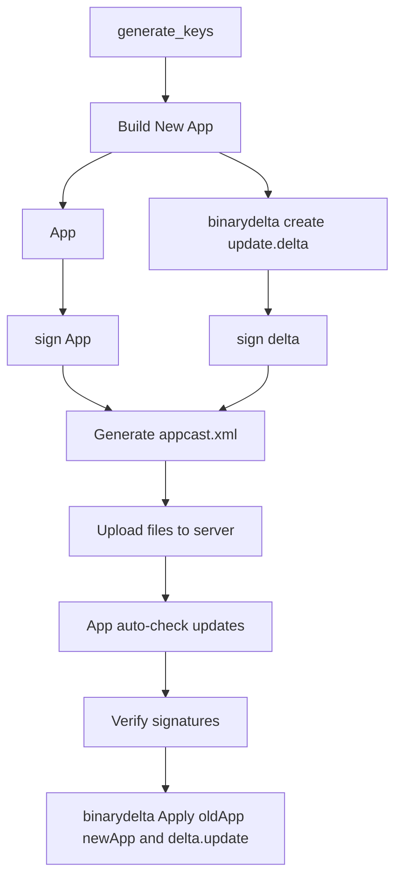

# SparkleUpdateTool for Publisher / Updater

# Fork and Clone  
- https://github.com/sparkle-project/Sparkle.git
- Copy BinaryDelta to App Folder

## Step 1 : Generate Public and Private Keys Using `generate_keys`

### Not a Must
- If you're on macOS, the private key will be saved into your Keychain, and the public key will be printed to the console.
- Add the public key to the `Info.plist` of each app you want to update.
- If you're implementing the update system yourself, make sure to extract and verify the public key manually for signature validation.

## Step 2: Binarydelta create update.delta

### Must Have
binarydelta create --verbose ./OStation.app ./OStationNew.app ./update.delta

- Creating version 4.1 patch using default compression...
- Processing source, ./OStation.app...
- Processing destination, ./OStationNew.app...
- Generating delta...
- Writing to temporary file /Users/lijiaxi/Documents/sparkleOldApp/.update.delta.tmp...
- ✏️  Updated /Contents/Resources/Base.lproj/Main.storyboardc/Info.plist
- ✏️  Updated /Contents/Resources/Base.lproj/Main.storyboardc/NSWindowController-B8D-0N-5wS.nib
- ✅  Added /Contents/Resources/buy.html
- ✏️  Updated /Contents/Resources/download.html
- 🔨  Diffed /Contents/_CodeSignature/CodeResources
- 🔨  Diffed /Contents/MacOS/OStation
- 🔨  Diffed /Contents/Resources/Base.lproj/Main.storyboardc/MainMenu.nib
- Done!

## Step 3 upload json file and delta file to https://unigo.ai/download
### Must Have

- https://unigo.ai/upload

## Step 4:  Way of Updater
- OStation App sholud check Json file on unigo.ai 
- If OStation App Version in Json file is advanced than local App Version then Update it 

## Step 5:  binarydelta apply 
- binarydelta apply OStation.app NewStation.app update.delta --verbose
- Applying version 4.1 patch...
- Verifying source...
- Copying files...
- Patching...
- ✏️  Updated /Contents/Resources/Base.lproj/Main.storyboardc/Info.plist
- ✏️  Updated /Contents/Resources/Base.lproj/Main.storyboardc/NSWindowController-B8D-0N-5wS.nib
- ✅  Added /Contents/Resources/buy.html
- ✏️  Updated /Contents/Resources/download.html
- 🔨  Patched /Contents/_CodeSignature/CodeResources
- 🔨  Patched /Contents/MacOS/OStation
- 🔨  Patched /Contents/Resources/Base.lproj/Main.storyboardc/MainMenu.nib
- Verifying destination...
- Done!

## Flowchart

